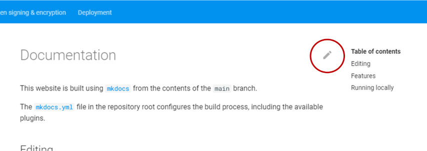

# Documentation

This website is built using [`mkdocs`](https://www.mkdocs.org/) from the contents of the `dev` (default) branch.

The [`mkdocs.yml`][mkdocs.yml] file in the repository root configures the build process, including the available plugins.

## Editing

All content lives under the [`docs/`][docs] directory in the repository.

To add new sections/articles, create new directories and files under the `docs/` directory, in Markdown format.

The pencil icon is a shortcut to quickly edit the content of the page you are viewing on the website:



*Above: Screenshot showing the edit pencil circled in red*

## Features

- [Material for MkDocs: Reference](https://squidfunk.github.io/mkdocs-material/reference/)

    See `mkdocs.yml` for enabled plugins/features

- [Mermaid](https://mermaid-js.github.io/mermaid/)

    Use code fences with `mermaid` type to render Mermaid diagrams within docs. For example, this markdown:

    ~~~markdown
    ```mermaid
    graph LR
        Start --> Stop
    ```
    ~~~

    Yields this diagram:

    ~~~mermaid
    graph LR
        Start --> Stop
    ~~~

## Running locally

The documentation website can be run locally using Docker Compose:

```bash
# from inside the localhost/ directory
docker-compose up docs
```

Browse to `http://localhost:${DOCS_LOCAL_PORT}` (<http://localhost:8001> by default) to view the docs site.

The website is automatically rebuilt as changes are made to local files.


[docs]: https://github.com/cal-itp/benefits/tree/dev/docs
[mkdocs.yml]: https://github.com/cal-itp/benefits/blob/dev/mkdocs.yml
